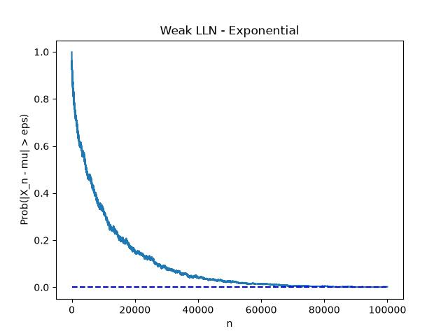
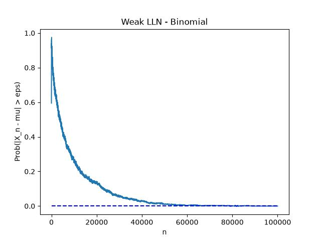
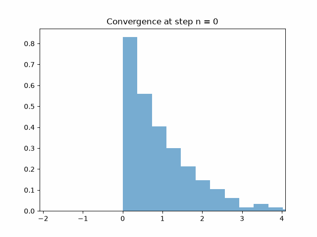

## 3.1 Law of Large Numbers

**Definition**: Let $X_n$ be a sequence of random variables. We say that $X_n$ converges in probability to $X$ (random variable) iff 

$$\lim_{n \rightarrow \infty} P(|X_n - X| > \varepsilon) = 0, \forall \varepsilon > 0.$$

We denote it by

$$X_n \xrightarrow{P} X.$$

**Definition**: Let $X_n$ be a sequencne of random variables. We say that $X_n$ converges almost surely to $X$ (random variable) iff

$$P(\omega \in \Omega: \lim_{n \rightarrow \infty} X_n(\omega) = X(\omega)) = 1,$$

this is the same to saying pointwise convergence. We simplify notation and write it like this:

$$P(\lim_{n \rightarrow \infty} X_n = X) = 1.$$

We denote it by

$$X_n \xrightarrow{a.s.} X.$$

**Theorem (Weak Law of Large Numbers)**: Let $X_n$ be a sequence of iid random variables such that for every $n$ $\mathbb{E}(X_n) = \mu < \infty$. Let 

$$\overline{X}_ n = \frac{1}{n} \sum_{i=0}^n X_i = \frac{X_1 + X_2 + ... + X_n}{n}.$$

Then

$$\overline{X}_ n \xrightarrow{P} \mu.$$

This is the same to say that

$$\lim_{n \rightarrow \infty} P(|X_n - \mu| > \varepsilon) = 0, \forall \varepsilon > 0.$$

**Theorem (Strong Law of Large Numbers)**: Let $X_n$ be a sequence of iid random variables such that for every $n$ $\mathbb{E}(X_n) = \mu < \infty$. Let

$$\overline{X}_ n = \frac{1}{n} \sum_{i=0}^n X_i = \frac{X_1 + X_2 + ... + X_n}{n}.$$ Then $$\overline{X}_ n \xrightarrow{a.s.} \mu.$$

This is the same to say that

$$P(\lim_{n \rightarrow \infty} X_n = \mu) = 1.$$

So now let's try to visualize it numerically.
Let's start with weak law. We do like this: 
- Fix `epsilon = 0.01`
- We perform `N=10000` experiments
    - In each experiment we get `n` observartions from our chosen distribution (in our case `np.random.exponential` and `np.random.binomial`).
    - We do a `cumsum`, i.e., we cumulate each observation on each step.
    - We compute when the error $|\overline{X_n} - \mu|$
- We check (compute probability) in how many of the experiments $|\overline{X_n} - \mu| > \varepsilon$, i.e., we compute the `mean`.
- Plot probability.

With the exponential distribution:

Then the binomial:

In both cases it's clear how the probability tends to 0 as the theorem states.

What about the strong law? We can a very similar process and see how it converges.

- We perform `N=10000` experiments
    - In each experiment we get `n` observartions from our chosen distribution (in our case `np.random.exponential`).
- We check the distribution on each step for all experiments.

With the exponential distribution:

We see how the distribution collapses into the point $\mu = 1$ which is the mean.