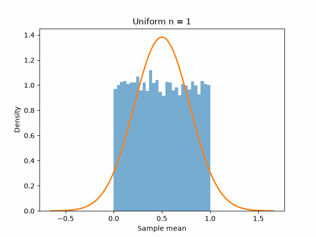
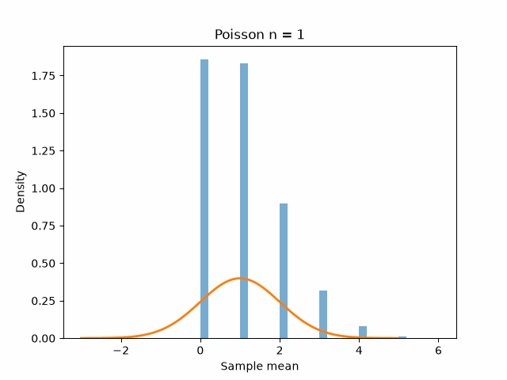
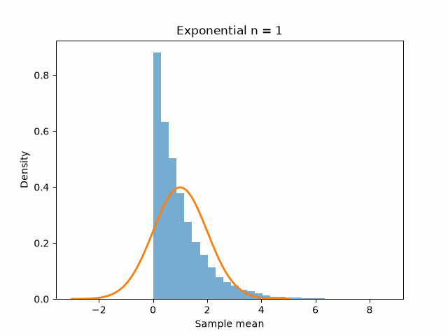
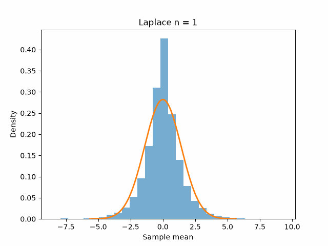
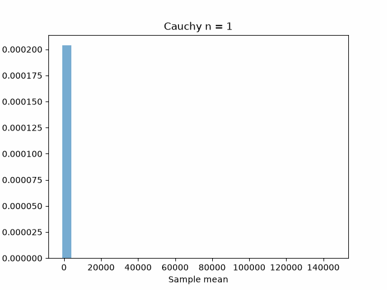

## 3.2 Central Limit Theorem

**Definition**: Let $X, X_1, X_2, ...$ be a collection of random variables. And let $F, F_1, F_2, ...$ be their corresponding distribution functions. We say that $X_n$ converges to $X$ in distribution iff $$lim_{n \rightarrow \infty} F_n(x) = F(x), \forall x.$$  We denote it by $$X_n \xrightarrow{d} X$$

**Theorem (CLT)** Let $X_1, X_2, ...$ be iid random variables such that $\mathbb{E}(X_i) = \mu < \infty$ and $Var(X_i) = \sigma^2 < \infty$ for all $i$. Let $$
\bar{X}_ n := \frac{1}{n} \sum_{i=1}^{n} X_i
$$ and $$
Z_n := \frac{\bar{X}_n - \mu}{\frac{\sigma}{\sqrt{n}}}.
$$
Then
$$\bar{X}_n \xrightarrow{d} X \sim \mathcal{N}(\mu, \frac{\sigma^2}{n}),$$
$$Z_n \xrightarrow{d} Z \sim \mathcal{N}(0, 1).$$

Let's try to see this experimentally in Python. The idea will be to

- Iterate over `n`, from `n=1` to `N`. `N` doesn't have to be too large, so we'll stay close to `50` but lower numbers will do the trick too.
- For each `n` iterate a significant amount of times and sample these `n` iid variables to compute their mean.
- Compare the results to the Gaussian and see how they approach it.

### When the theorem breaks

We could try doing this for any distribution, but there're two very important hypotheses: $\mathbb{E}(X_i) = \mu < \infty$ and $Var(X_i) = \sigma^2 < \infty$. One could think that those hypotheses could be overriden, but that's not at all the case. Let's see what happens when we try doing the same thing with a Cauchy distribution:

The distribution never looks like a Gaussian!